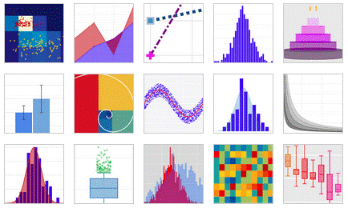

```{r child = "../setup.Rmd"}
```

```{r packages, echo=FALSE, message=FALSE, warning=FALSE}
# AGREGAR PAQUETES A UTILIZAR

```
class: inverse, center, middle

## CLASE 1 
### CREACIÓN DE GRÁFICOS EN R

---

## Introducción

- R es un entorno y lenguaje de programación ampliamente usado en la ciencia de datos, principalmente en el análisis estadístico.
- La relación de R con el análisis de datos ambientales se evidencia ampliamente en la gran cantidad de paquetes modulares que se usan con este fin.


---

## Objetivo

- El objetivo del presente curso es proporcionar los conocimientos básicos para empezar a trabajar con el lenguaje de programación R, enfocado a su uso como herramienta principal en la gestión y análisis de datos.


---

## Gráficos con R base

- Al instalar el lenguaje de programación R, se incluyen funciones básicas de manera predeterminada para la creación de gráficos. Sin embargo, estas funciones son limitadas en cuanto a la edición y visualización de resultados.
- La función **plot()** se usa de manera general para la creación de gráficos




---

## Barplot

- El gráfico de barras nos muetra la frecuencia con la que se han observado los datos de una variable discreta, donde cada una de las barras es una categoría de la variable.

```{r , echo = TRUE , collapse = TRUE, out.width="60%", fig.align="center"}

# VISUALIZACIÓN DE LOS DATOS
head(iris,3)

#CREACIÓN DEL BARPLOT
plot(iris$Species)

```

---

- Podemos modificar los argumentos de cualquier gráfico generado con la función **plot** para obtener un gráfico más presentable.

```{r , echo = TRUE , collapse = TRUE, out.width="80%", fig.align="center"}

#CREACIÓN DEL BARPLOT
plot(iris$Species, main = "Tipos de especie de Iris",
     xlab = "Especie", ylab = "Frecuencia", 
     col = c("royalblue", "skyblue", "blue"))

```

---

- Usando la función **legend()** podemos incluir una leyenda al gráfico.

```{r , echo = TRUE , collapse = TRUE, out.width="80%", fig.align="center"}

#CREACIÓN DEL BARPLOT
plot(iris$Species, main = "Tipos de especie de Iris",
     xlab = "Especie", ylab = "Frecuencia", 
     col = c("royalblue", "skyblue", "blue"))

legend(x = "topright", legend = levels(iris$Species), 
       fill = c("royalblue", "skyblue", "blue"), 
       title = "Especies", cex = 0.5)

```

---

## Histograma

- Un histograma nos permite visualizar la distribución de un conjunto de datos numérico, donde cada barra representa el número de veces (frecuencia) en el que se observan los datos dentro de un intervalo definido.

```{r , echo = TRUE , collapse = TRUE, out.width="80%", fig.align="center"}

#CREACIÓN DEL HISTOGRAMA
hist(iris$Sepal.Length, main = "Histograma del largo de sépalo",
     xlab = "Intervalo", ylab = "Frecuencia", 
     col = c("deepskyblue4"))

```


---

## Scatter plot

- El diagrama de dispersión muestra la variación de una variable numérica o la relación entre dos variables numéricas.

```{r , echo = TRUE , collapse = TRUE, out.width="80%", fig.align="center"}

#CREACIÓN DEL SCATTER PLOT
plot(iris$Sepal.Length, iris$Petal.Length)

```

---

- Podemos modificar los argumentos de cualquier gráfico generado con la función **plot** para obtener un gráfico más presentable.

```{r , echo = TRUE , collapse = TRUE, out.width="80%", fig.align="center"}

#CREACIÓN DEL SCATTER PLOT
plot(iris$Sepal.Length, iris$Petal.Length, 
     xlab = "Largo de sépalo" , ylab = "Largo de pétalo",
     main = "Diagrama de dispersión - LS VS LP",
     col = c("green", "purple", "blue"))

legend(x = "topright", legend = levels(iris$Species), 
       fill = c("green", "purple", "blue"), 
       title = "Especies", cex = 0.5)

```

---

## Boxplot

- Los diagramas de caja nos muetran la distribución de una variable numérica tomando como referencia los cuartiles (intervalos regulares que dividen al conjunto de datos en cuatro partes).
- Se conoce como rango intercuantil (IQR) a la región comprendida entre el tercer cuartil (0.75) y el primer cuartil (0.25).

```{r , echo = TRUE , collapse = TRUE, out.width="80%", fig.align="center"}

#CREACIÓN DEL BOXPLOT
boxplot(iris)

```

---

- Podemos modificar los argumentos de cualquier gráfico generado con la función **plot** para obtener un gráfico más presentable.

```{r , echo = TRUE , collapse = TRUE, out.width="80%", fig.align="center"}

#CREACIÓN DEL BOXPLOT
plot(x = iris$Species, y = iris$Sepal.Length,
     col = c("green", "purple", "blue"))

legend(x = "bottomright", legend = levels(iris$Species), 
       fill = c("green", "purple", "blue"), 
       title = "Especies", cex = 0.3)

```


---

## Exportar gráficos

- Se pueden exportar los gráficos generados en R usando la función que corresponda al formato del archivo de salida (png, jpeg, pdf, tiff, etc.).
- La función de exportación de gráficos tiene tres argumentos principales: el nombre del archivo, el ancho y el alto.

```{r , echo = TRUE , collapse = TRUE, out.width="80%", fig.align="center"}

#CREACIÓN DEL BOXPLOT
png(filename = "boxplot-grafico.png", width = 800, height = 600)

plot(x = iris$Species, y = iris$Sepal.Length,
     col = c("green", "purple", "blue"))

legend(x = "bottomright", legend = levels(iris$Species), 
       fill = c("green", "purple", "blue"), 
       title = "Especies", cex = 0.5)

dev.off()
```
---

class: inverse, center, middle

## GRÁFICOS CON GGPLOT2 

---

## El paquete "ggplot2"

- La librería **ggplot2** nos permite la visualización de datos basado en una gramática subyacente, lo que nos permite crear gráficos de alta calidad a partir de elementos independientes.


---

## Gramática de gráficos

- La librería **ggplot2** presenta una gramática para la construcción de sus gráficos basado en el libro "The Grammar of Graphics" de Leland Wilkinson, esto nos permite describir las características de los elementos de un gráfico estadístico. Los elementos que componen un gráfico son: 
  - La capa o "**layer**": Es una colección de elementos geométricos (**geom**) y transformaciones estadísticas (**stat**). 
  - La escala o "**scale**": Nos permiten modificar el color, forma o tamaño del gráfico. Además, permite crear una leyenda y modificar los ejes.
  - El sistema de coordenadas o "**coord**": Describe cómo las coordenadas de datos se asignan al plano de la gráfica. También proporciona ejes y líneas de cuadrícula para ayudar a leer el gráfico.
  - La faceta o "**facet**": Especifica cómo dividir y mostrar subconjuntos de datos como pequeños múltiplos.
  - El tema o "**theme**": Nos permite modificar atributos del gráfico como el tamaño de fuente y el color de fondo.

---

## Scatter plot

```{r , echo = TRUE , collapse = TRUE, out.width="80%", fig.align="center"}
# MANEJO DE DATOS DE CALIDAD DE AIRE
df <- airquality
df$date <- paste("1973", airquality$Month, airquality$Day, sep = "-")
df$date <- as.Date(df$date, format = "%Y-%m-%d")
head(df, 3)

# RESUMEN DE LOS DATOS
summary(df)

```

---

## Scatter plot

```{r , echo = TRUE , collapse = TRUE, out.width="80%", fig.align="center"}

#CREACIÓN DEL SCATTER PLOT
library(ggplot2)
ggplot(df, aes(x = date, y = Ozone)) + 
  geom_point(color = "darkcyan")

```

---

- Se puede modificar la estética del gráfico haciendo uso de los argumentos de la función **ggplot2**. Por ejemplo se pueden modificar el tamaño, la forma, el color, entre otros atributos estéticos.

```{r , echo = TRUE , collapse = TRUE, out.width="80%", fig.align="center"}

#CREACIÓN DEL SCATTER PLOT
ggplot(iris, aes(Sepal.Length, Petal.Length, 
                 color = Species, shape = Species)) + 
  geom_point() +
  scale_color_manual(values=c("skyblue", "cyan", "blue"))

```
---

- Podemos modificar los colores de la leyenda usando una escala o "scale". En el caso que necesitemos modificar los colores de una variable discreta se puede realizar la asignación de colores de forma manual o usando una paleta de colores.

```{r , echo = TRUE , collapse = TRUE, out.width="80%", fig.align="center"}

#CREACIÓN DEL SCATTER PLOT
ggplot(iris, aes(Sepal.Length, Petal.Length, 
                 color = Species, shape = Species)) + 
  geom_point() +
  scale_color_brewer(palette="Accent")

```

---

- La librería **wesanderson** contiene más opciones de paletas de colores.

```{r , echo = TRUE , collapse = TRUE, out.width="80%", fig.align="center"}

library(wesanderson)

#CREACIÓN DEL SCATTER PLOT
ggplot(iris, aes(Sepal.Length, Petal.Length, 
                 color = Species, shape = Species)) + 
  geom_point() +
  scale_color_manual(values=wes_palette(n=3, name="Cavalcanti1"))

```

---

- En el caso que necesitemos modificar la paleta de colores para una variable continua se necesitaría modificar la escala de tipo gradiente.

```{r , echo = TRUE , collapse = TRUE, out.width="80%", fig.align="center"}

#CREACIÓN DEL SCATTER PLOT
ggplot(iris, aes(Sepal.Length, Petal.Length, 
                 color = Sepal.Width, shape = Species)) + 
  geom_point() +
  scale_color_gradient(low = "blue", high = "red")
 

```
---

- Se puede modificar la escala de tipo gradiente usando una paleta de colores.

```{r , echo = TRUE , collapse = TRUE, out.width="80%", fig.align="center"}

#CREACIÓN DEL SCATTER PLOT
ggplot(iris, aes(Sepal.Length, Petal.Length, 
                 color = Sepal.Width)) + 
  geom_point() +
  scale_color_gradientn(colors = rainbow(3))
 

```

---

- Podemos añadir una linea de tendencia a nuestro gráfico.

```{r , echo = TRUE , collapse = TRUE, out.width="80%", fig.align="center"}

#CREACIÓN DEL SCATTER PLOT
ggplot(df, aes(date, Ozone, color = Ozone)) + 
  geom_point() +
  geom_smooth() +
  scale_color_gradient(low = "blue", high = "red")

```

---

## Barplot

- El diagrama de barras presenta un argumento más para la asignación de color. El argumento **color** selecciona el color del contorno y el argumento **fill** selecciona el color de relleno de las barras.

```{r , echo = TRUE , collapse = TRUE, out.width="80%", fig.align="center"}

#CREACIÓN DEL BARPLOT
ggplot(iris, aes(x = Species)) + 
  geom_bar(color = "blue", fill = "white")
 

```
---

- Podemos modificar los colores de cada barra usando una escala de colores manual.

```{r , echo = TRUE , collapse = TRUE, out.width="80%", fig.align="center"}

#CREACIÓN DEL BARPLOT
ggplot(iris, aes(x = Species, fill = Species)) + 
  geom_bar()+
  scale_fill_manual(values=c("blue", "skyblue", "darkblue"))
 

```
---

- Podemos modificar los colores de cada barra usando una paleta de colores.

```{r , echo = TRUE , collapse = TRUE, out.width="80%", fig.align="center"}

#CREACIÓN DEL BARPLOT
ggplot(iris, aes(x = Species, fill = Species)) + 
  geom_bar(color = "black", width = 0.5)+
  scale_fill_brewer(palette="Dark2")

```

---

- El barplot por defecto nos muestra la frecuencia de una variable discreta, sin embargo, se puede añadir una variable más que pueda remplazar la frecuencia.

```{r , echo = TRUE , collapse = TRUE, out.width="80%", fig.align="center"}

#CREACIÓN DEL BARPLOT
ggplot(iris, aes(x = Species, y = Sepal.Length)) + 
  geom_bar(stat="identity", fill = "blue", width=0.5)
 

```

---

- En los gráficos de **ggplot2** podemos modificar el tema o **theme** para obtener mayor control del fondo y tamaños de fuente.

```{r , echo = TRUE , collapse = TRUE, out.width="80%", fig.align="center"}

#CREACIÓN DEL BARPLOT
ggplot(iris, aes(x = Species, y = Sepal.Length)) + 
  geom_bar(stat="identity", fill = "blue", width=0.5) +
  theme_bw()
 

```

---

- Podemos agregar un título y modificar el texto de los ejes.

```{r , echo = TRUE , collapse = TRUE, out.width="80%", fig.align="center"}

#CREACIÓN DEL BARPLOT
ggplot(iris, aes(x = Species, fill = Species)) + 
  geom_bar(color = "black", width = 0.5)+
  scale_fill_brewer(palette="Dark2") +
  theme(legend.position="bottom") +
  ggtitle("Barplot - Iris Dataset") +
  xlab("Especies") + ylab("Frecuencia") +
  labs(fill = "Especies de Iris")

```
---

- Modificando los argumentos del tema podemos editar la leyenda.

```{r , echo = TRUE , collapse = TRUE, out.width="60%", fig.align="center"}

#CREACIÓN DEL BARPLOT
ggplot(iris, aes(x = Species, fill = Species)) + 
  geom_bar(color = "black", width = 0.5)+
  scale_fill_brewer(palette="Dark2") +
  ggtitle("Barplot - Iris Dataset") +
  xlab("Especies") + ylab("Frecuencia") +
  labs(fill = "Especies de Iris") +
  theme(legend.position="bottom",
        plot.title = element_text(color="red", face="bold.italic", hjust = 0.5),
        axis.title.x = element_text(color="blue", size=14, face="bold"),
        axis.title.y = element_text(color="black", size=14, face="bold")
)
  
```

---

## Boxplot

- Se puede generar un diagrama de cajas a partir de una variable continua.

```{r , echo = TRUE , collapse = TRUE, out.width="60%", fig.align="center"}

#CREACIÓN DEL BARPLOT
ggplot(iris, aes(x = Species, y = Sepal.Length, color = Species)) + 
  geom_boxplot()

```

---

- La librería **ggplot2** nos permite usar las facetas o **facet** para dividir los datos en subconjuntos, de esta manera se mostrara un gráfico para cada subconjunto.

```{r , echo = TRUE , collapse = TRUE, out.width="60%", fig.align="center"}

#CREACIÓN DEL BARPLOT
ggplot(iris, aes(y = Sepal.Length, color = Species)) + 
  geom_boxplot() +
  facet_wrap(~Species) 

```
  
---

## Histograma 

- Se puede crear un histograma para una variable numérica

```{r , echo = TRUE , collapse = TRUE, out.width="60%", fig.align="center"}

#CREACIÓN DEL BARPLOT
ggplot(df, aes(Temp)) + 
  geom_histogram(fill = "skyblue") +
  ggtitle("Histograma - Air quality Dataset") +
  xlab("Temperatura ambiental (°C)") + ylab("Frecuencia") 

    
```
---

## Exportar gráficos

- Se pueden exportar los gráficos generados usando la función **ggsave**.

```{r , echo = TRUE , collapse = TRUE, out.width="60%", fig.align="center"}

#CREACIÓN DEL BARPLOT
gf_1 <- ggplot(df, aes(Temp)) + 
  geom_histogram(fill = "skyblue") +
  ggtitle("Histograma - Air quality Dataset") +
  xlab("Temperatura ambiental (°C)") + ylab("Frecuencia") 

ggsave("plot-temperatura.png", gf_1, width = 5, height = 5)
    
```

---

class: inverse, center, middle

# GRACIAS! <br/>  <a href="mailto: marvinjqs@gmail.com">  </a> 


