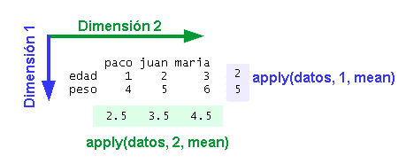

```{r child = "../setup.Rmd"}
```

```{r packages, echo=FALSE, message=FALSE, warning=FALSE}
# AGREGAR PAQUETES A UTILIZAR

```
class: inverse, center, middle

## CLASE 5 
### FAMILIA DE FUNCIONES APPLY()


---

## ¿Qué son las funciones apply()?

- La familia de funciones **apply()** pertenecen a R base, y nos permiten ejecutar lineas de código repetidamente en múltiples fragmentos de datos.
- Estas funciones nos permiten ejecutar bucles en pocas líneas de código




---

## apply()

- Esta función tiene como argumento un dataframe o matriz 2D y devuelve como resultado un vector.

```{r , echo = TRUE , collapse = TRUE, out.width="60%", fig.align="center"}

# OBTENER SUMAS POR FILA
df_1 <- data.frame(1:3,7:9)
apply(df_1, MARGIN = 1, FUN = sum)

# SUMAR 10 A CADA OBSERVACION EN TODO EL DF
apply(df_1, MARGIN = 1:2,  function(x) x+10)

# OBTENER PROMEDIOS POR COLUMNA
apply(airquality, 2, mean, na.rm=TRUE)

# OBTENER EL NÚMERO DE NA POR COLUMNA
apply(airquality, 2, function (x) sum(is.na(x)))

```

---

## lapply()

- Esta función tiene como argumento una lista o vector y devuelve como resultado una lista.

```{r , echo = TRUE , collapse = TRUE, out.width="60%", fig.align="center"}

# OBTENER SUMAS POR ELEMENTO DE LA LISTA
ls_1 <- list(1:10,21:30)
lapply(ls_1, FUN = sum)
unlist(lapply(ls_1, FUN = sum))

```

---

## sapply()

- Esta función tiene como argumento una lista o vector y devuelve como resultado un vector (simplificación de lapply).

```{r , echo = TRUE , collapse = TRUE, out.width="60%", fig.align="center"}

# OBTENER SUMAS POR ELEMENTO DE LA LISTA
ls_1 <- list(1:10,21:30)
sapply(ls_1, FUN = sum)
sapply(ls_1, FUN = sum, simplify = F)

```
---

## vapply()

- Esta función tiene como argumento una lista o vector y devuelve como resultado un vector (simplificación de lapply) sí la comparación de valor de retorno es correcta.

```{r , echo = TRUE , collapse = TRUE, out.width="60%", fig.align="center"}

# OBTENER SUMAS POR ELEMENTO DE LA LISTA
ls_1 <- list(1:10,21:30)
vapply(ls_1, FUN = sum, numeric(1))

```

---

## mapply()

- Esta función tiene como argumento dos o más listas o vectores y devuelve como resultado un vector o matriz.

```{r , echo = TRUE , collapse = TRUE, out.width="60%", fig.align="center"}

# OBTENER SUMAS POR ELEMENTO DE LA LISTA
ls_1 <- list(1:10,21:30)
ls_2 <- list(11:20,31:40)
mapply(function (x,y) x + y, ls_1, ls_2)

```

---

## tapply()

- Esta función tiene como argumento una lista o vectores y devuelve como resultado un vector o matriz, haciendo agrupaciones en base a subconjuntos para ejecutar la función (parecido al argumento "by").

```{r , echo = TRUE , collapse = TRUE, out.width="60%", fig.align="center"}

# OBTENER PROMEDIOS POR ELEMENTO DE LA LISTA
tapply(iris$Petal.Length, iris$Species, sd)
tapply(iris$Petal.Length, iris$Species, 
       function(x) mean(x, na.rm = TRUE))

```

---


class: inverse, center, middle

# GRACIAS! <br/>  <a href="mailto: marvinjqs@gmail.com">  </a> 


